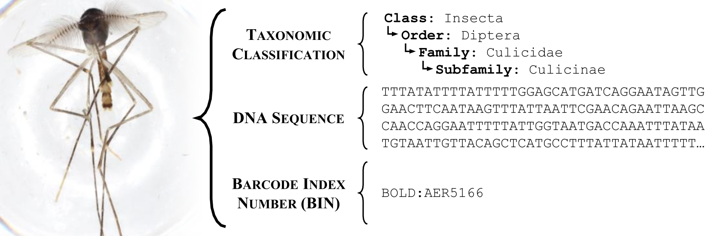

# BIOSCAN-1M

###### <h3> Overview
This repository houses the codes and data pertaining to the BIOSCAN-1M project. 
Within this project, we introduce the BIOSCAN-1M Insect dataset, which can be accessed 
for download via the provided link. The repository encompasses code for data sampling and splitting, 
dataset statistics analysis, as well as image-based classification experiments centered around 
the taxonomy classification of insects. 
 
###### <h3> Dataset
BIOSCAN dataset provides researchers with information about insects. 
Three main sources of information published by the BIOSCAN dataset are: 

###### <h4> I. DNA Barcode Sequences and Barcode Indexing 
* DNA barcode sequence
* Barcode Index Number (BIN)



###### <h4> II. Biological Taxonomy Ranking


###### <h4> III. RGB Images 

We publish four packages of the BIOSCAN-1M Insect images, 
each package is structured with 113 chunks of 10,000 images each:
- (1) Original JPEG images.
- (2) Cropped JPEG images.
- (3) Original JPEG images resized to 256 on the smaller dimensions.
- (4) Cropped JPEG images resized to 256 on their smaller dimension.

<div align="center">

|  |  |  |  |
|:---:|:---:|:---:|:---:|
| **Blattodea** | **Hemiptera** | **Archaeognatha** | **Psocodea** |

|  |  |  |  |
|:---:|:---:|:---:|:---:|
| **Embioptera** | **Dermaptera** | **Ephemeroptera** | **Odonata** |

|  |  |  |  |
|:---:|:---:|:---:|:---:|
| **Plecoptera** | **Thysanoptera** | **Neuroptera** | **Trichoptera** |

|  |  |  |  |
|:---:|:---:|:---:|:---:|
| **Hymenoptera** | **Orthoptera** | **Coleoptera** | **Diptera** |

</div>

###### <h3> Metadata File
In addition to the image dataset, we have also published a corresponding metadata file for our dataset, 
named "BIOSCAN_Insect_Dataset_metadata". This metadata file is available in both dataframe format (.tsv) 
and JSON-LD format (.jsonld). 
The metadata file encompasses valuable information, including taxonomy annotations, DNA barcode sequences, 
and indexes and labels for each data sample. Furthermore, the metadata file includes the image names and unique IDs 
that reference the corresponding storage location of each image. It also provides insights into the roles of the 
images within the split sets. Specifically, it indicates whether an image is used for training, validation, or 
testing in the six experiments conducted in our paper. 

To run the following steps you first need to download dataset and the metadata file, 
and make path settings appropriately.

###### <h3> Dataset Statistics
To see statistics of the dataset, and run the following:
```bash
python main.py --print_statistics 
``` 
 
To split dataset into Train, Validation and Test sets run the following:
```bash
python main.py --make_split --print_split_statistics
``` 
 
###### <h3> Classification Experiments
Two image-based classification experiments were conducted, focusing on the taxonomy ranking of insects. 
The first set of experiments involved classifying images of insects into 16 Orders. 
The second set of experiments specifically targeted the Order Diptera and 
aimed to classify its members into 40 families, which constitute a significant portion of the order.

To train the model on classification task using a baseline model run setting the name of experiments:
```bash
python main.py --loader --train --exp_name small_insect_order
``` 

###### <h3> Preprocessing
In order to enhance efficiency in terms of time and computational resources for conducting experiments 
on the BIOSCAN dataset's RGB images, we implemented an offline preprocessing step. This involved utilizing 
a cropping tool to modify the original RGB images. 
By applying this preprocessing step, we aimed to optimize the subsequent experimental processes.


To use our cropping tool, run the following:


```bash
python main.py --crop_image
``` 


###### <h3> Requirement 
The requirements file used to run experiments is available in the requirement.txt.
  

###### <h3> Lic 
The images included in the BIOSCAN-1M Insect datasets available through this repository are subject to copyright 
and licensing restrictions shown in the following:

 - Copyright Holder: CBG Photography Group
 - Copyright Institution: Centre for Biodiversity Genomics (email:CBGImaging@gmail.com)
 - Photographer: CBG Robotic Imager
 - Copyright License: Creative Commons-Attribution Non-Commercial Share-Alike
 - Copyright Contact: collectionsBIO@gmail.com
 - Copyright Year: 2021

###### <h3> Collaborators
"Nicholas Pellegrino" <nicholas.pellegrino@uwaterloo.ca> & "Ming Gong" <ming_gong@sfu.ca>  

 

 

 

