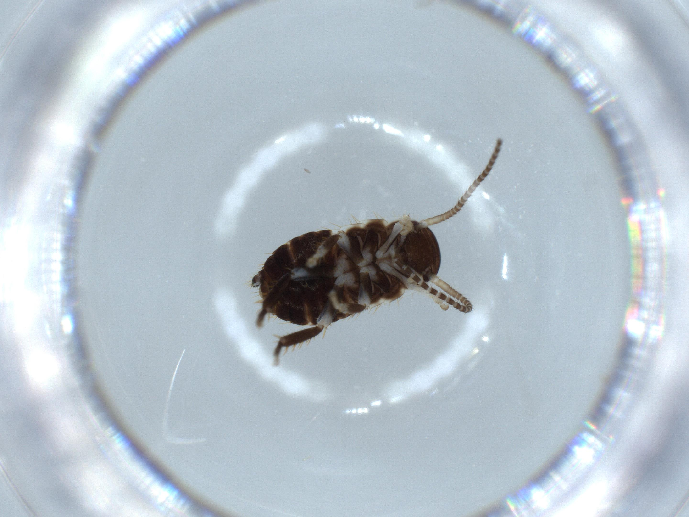
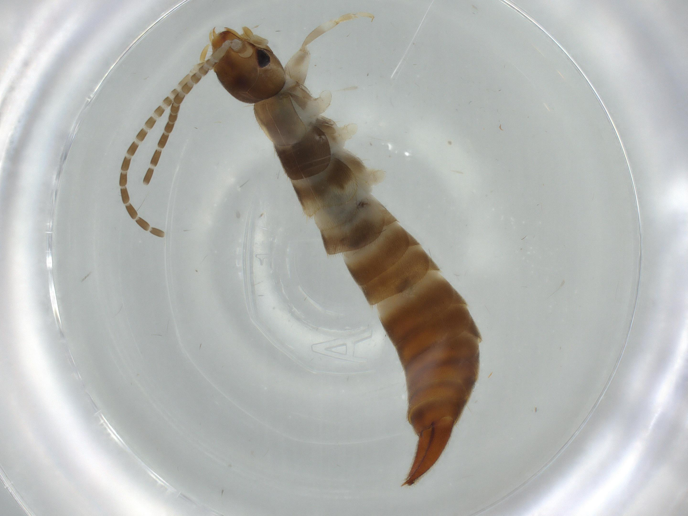
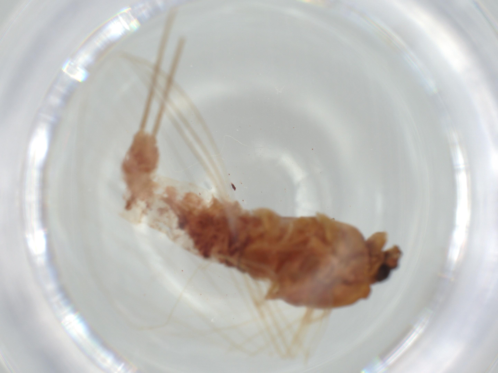
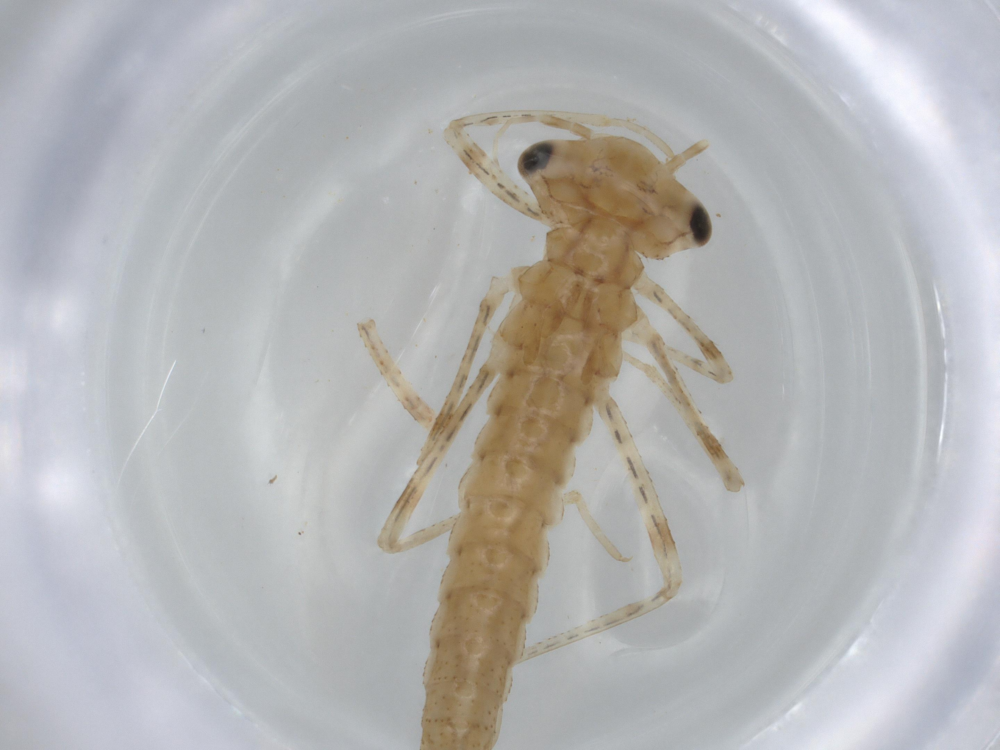
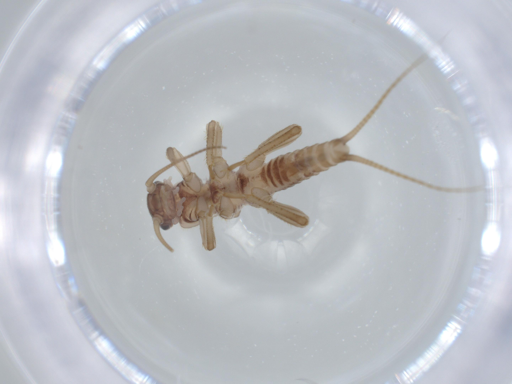
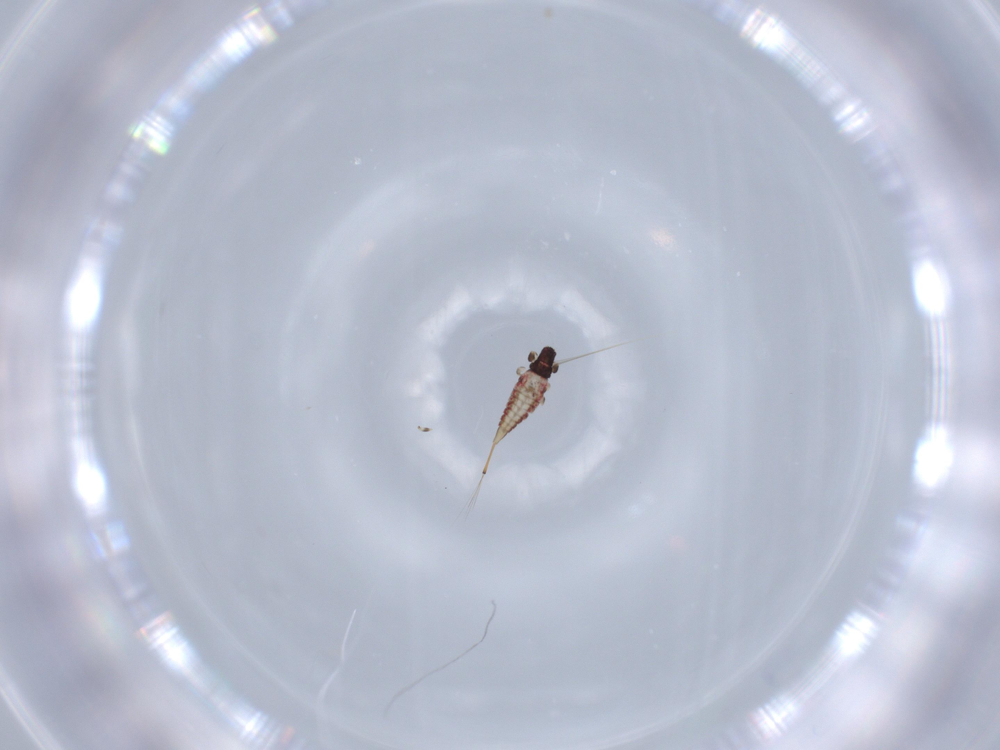
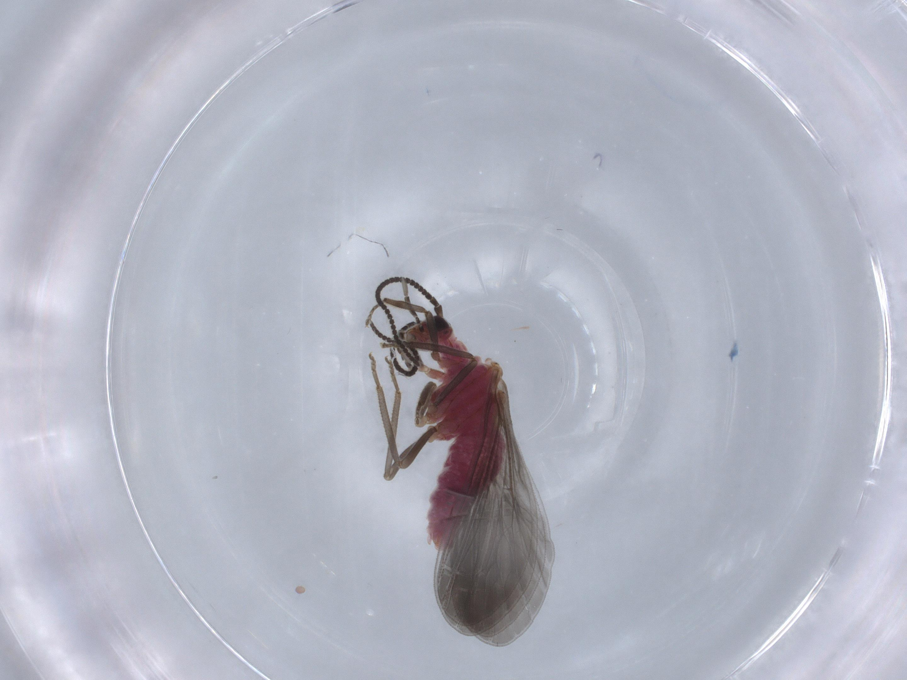
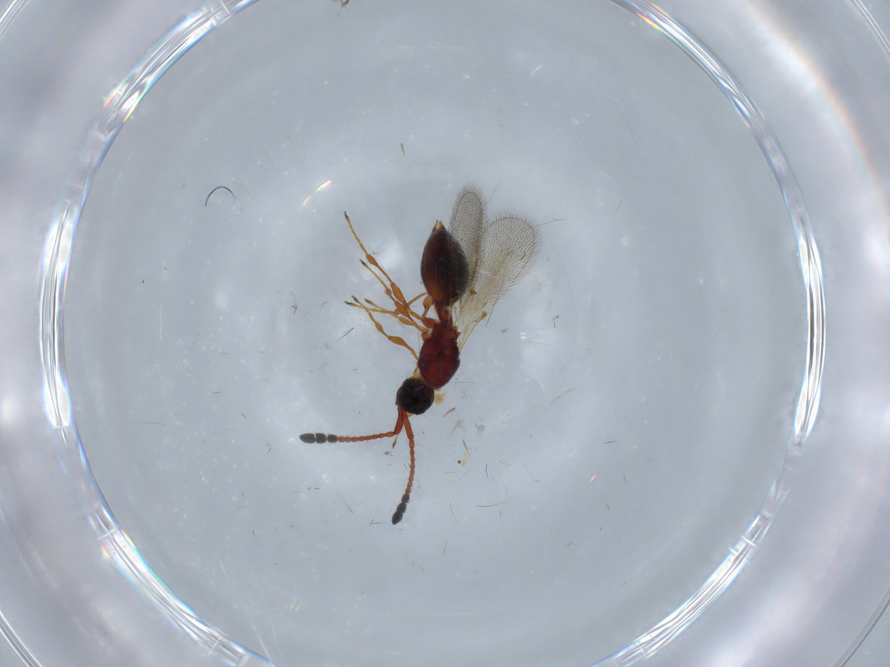
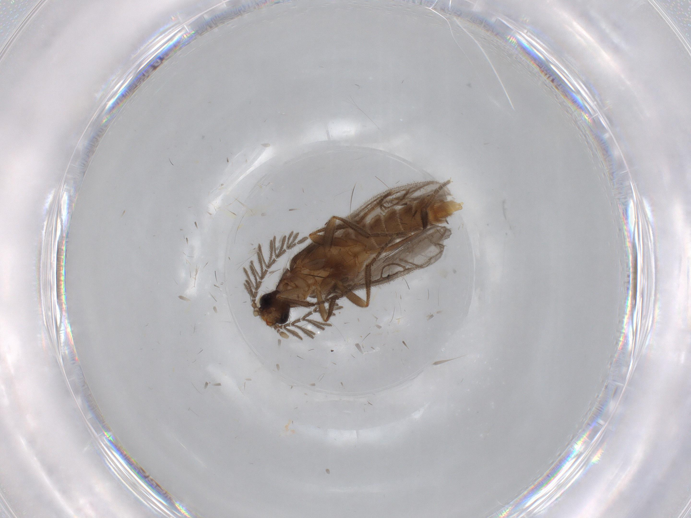

# BioScan-1M
  <p align="middle">
  
  
  
  
  
  
  
  
  
  
  
  
  
  
  
</p>

<p align="middle">  $$ Insect \space Orders $$ </p>

$${\color{red}Blattodea \space \space \color{blue}Hemiptera \space \space \color{orange}Archaeognatha \space  \space \color{green}Psocodea \space \space \color{purple}Embioptera}$$

$${\color{red}Dermaptera \space \space \color{blue}Ephemeroptera \space \space \color{orange}Odonata \space \space \color{green}Plecoptera \space \space \color{purple}Thysanoptera}$$
  
$${\color{red}Neuroptera \space \space \color{blue}Trichoptera \space \space \color{orange}Hymenoptera \space \space \color{green}Zoraptera \space \space \color{purple}Coleoptera}$$

###### <h3> Overview
 
This repository contains the codes and data for BioScan-1M datasets project. In this project, three datasets of different number of images are published. The dataset files can be downloaded throuh **link**. We also conducted "Order" level clasification experiments based on RGB images of the insects using basline method inspired by [PlantNet-300K](https://github.com/plantnet/PlantNet-300K/edit/main/README.md) and a transformer based approach the **ViT** as well. 
 
 
###### <h3> Datasets
The datasets contains RGB images, metadata information and the Barcode DNA indexing of the insects. Three sizes of the dataset created for publication are Small, Medium and Big. Our Small, Medium and Big datasets respectively contain 82728, 200K and 1.2M RGB images of the insects. Due to extreme class inbalances not all orders have sufficient samples for splitting data into Train, Validation and Test sets. 

 
Due to limited space, there are only metadats files of the small dataset and its train, validation and test splits available in dataset folder together with a small set of RGB images.
 
To see statistics of the small dataset run the follwoing:
```bash
python main.py --print_statistics
``` 
 
To split the small dataset into Train, Validation and Test sets run the follwoing:
```bash
python main.py --make_split
``` 
 
###### <h3> Insect Order Classification 
We conducted multi-class classification experiments using BioScan datasets. There are two sets of experiments. First we ran experiments based on the baseline method and then we utilized a transformer based model ViT to run our experiments.  

To train the model on classification task using a baseline model run:
```bash
python main.py --loader --train
``` 

###### <h3> Requirement 
The requirements file used to run experiments is available in the requirement.txt.

 

 

 

