# BIOSCAN-1M

###### <h3> Overview
This repository houses the codes and data pertaining to the [BIOSCAN-1M-Insect project](https://biodiversitygenomics.net/1M_insects/). 
Within this project, we introduce the __BIOSCAN-1M Insect dataset__, which can be accessed 
for download via the provided links. The repository encompasses code for data sampling and splitting, 
dataset statistics analysis, as well as image-based classification experiments centered around 
the taxonomy classification of insects. 


Anyone interested in using BIOSCAN-1M Insect dataset and/or the corresponding code repository, please cite the [Paper](http://arxiv.org/abs/2307.10455):

```
@misc{gharaee2023step,
    title={A Step Towards Worldwide Biodiversity Assessment: The BIOSCAN-1M Insect Dataset},
    author={Gharaee, Z. and Gong, Z. and Pellegrino, N. and Zarubiieva, I. and Haurum, J. B. and Lowe, S. C. and McKeown, J. T. A. and Ho, C. Y. and McLeod, J. and Wei, Y. C. and Agda, J. and Ratnasingham, S. and Steinke, D. and Chang, A. X. and Taylor, G. W. and Fieguth, P.},
    year={2023},
    eprint={2307.10455},
    archivePrefix={arXiv},
    primaryClass={cs.CV}
}
```


###### <h3> Dataset
BIOSCAN dataset provides researchers with information about insects. 
Three main sources of information published by the BIOSCAN-1M Insect dataset are: 

###### <h4> I. DNA Barcode Sequences and Barcode Indexing 
* DNA barcode sequence
* Barcode Index Number (BIN)

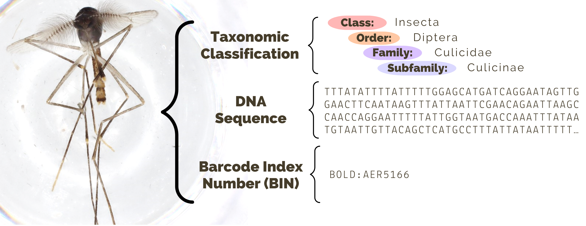

###### <h4> II. Biological Taxonomy Ranking
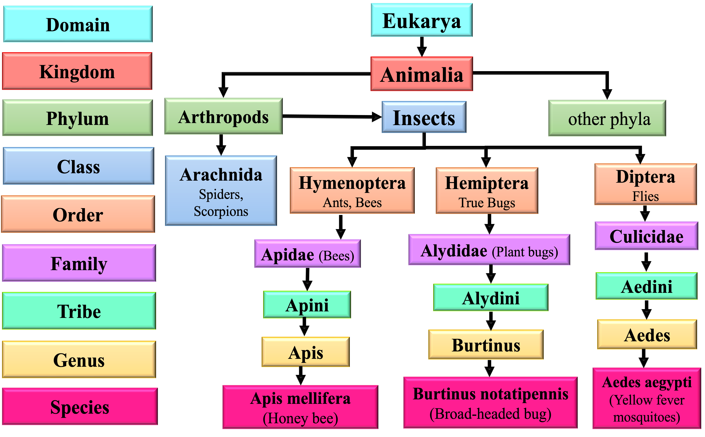

###### <h4> III. RGB Images 

We have published six packages, each containing 1,128,313 BIOSCAN-1M Insect dataset's images. 
These packages follow a consistent data structure, where the images are divided into 113 data chunks. 
Each chunk consists of 10,000 images, except for chunk 113, which contains 8,313 images.
- (1) Original JPEG images (113 zip files).
- (2) Cropped JPEG images (113 zip files).
- (3) Original JPEG images resized to 256 on the smaller dimension (ZIP and HDF5).
- (4) Cropped JPEG images resized to 256 on their smaller dimension (ZIP and HDF5).

<div align="center">

|  | 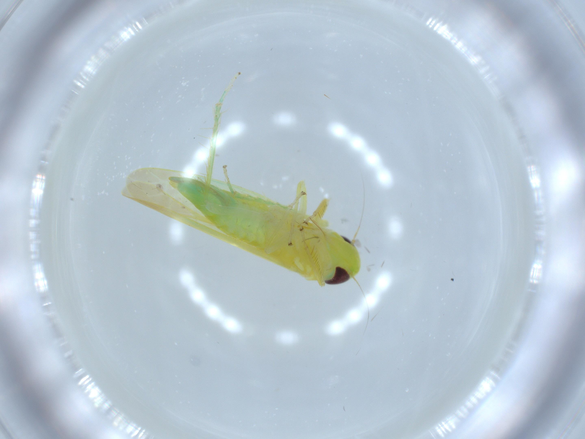 |  |  |
|:---:|:---:|:---:|:---:|
| **Blattodea** | **Hemiptera** | **Archaeognatha** | **Psocodea** |

|  |  |  |  |
|:---:|:---:|:---:|:---:|
| **Embioptera** | **Dermaptera** | **Ephemeroptera** | **Odonata** |

|  |  |  |  |
|:---:|:---:|:---:|:---:|
| **Plecoptera** | **Thysanoptera** | **Neuroptera** | **Trichoptera** |

|  |  |  | 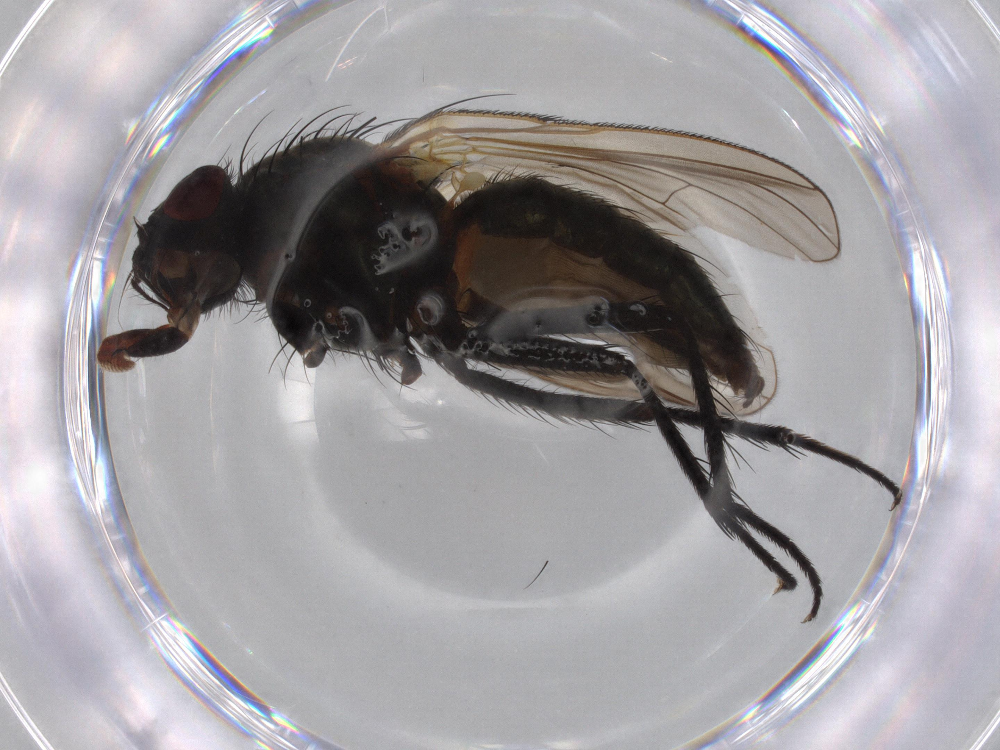 |
|:---:|:---:|:---:|:---:|
| **Hymenoptera** | **Orthoptera** | **Coleoptera** | **Diptera** |

</div>

###### <h3> Metadata 
In addition to the image dataset, we have also published a corresponding metadata file for our dataset, 
named BIOSCAN_Insect_Dataset_metadata. This metadata file is available in both dataframe format (.tsv) 
and JSON-LD format (.jsonld). 
The metadata file encompasses valuable information, including taxonomy annotations, DNA barcode sequences, 
and indexes and labels for each data sample. Furthermore, the metadata file includes the image names and unique IDs 
that reference the corresponding storage location of each image. It also provides insights into the roles of the 
images within the split sets. Specifically, it indicates whether an image is used for training, validation, or 
testing in the six experiments conducted in our paper. 

To run the following steps you first need to download dataset and the metadata file, 
and make path settings appropriately.
###### <h3> Dataset Access
The BIOSCAN-1M Insect dataset is available both on [GoogleDrive](https://drive.google.com/drive/folders/1ft17GpcC_xDhx5lOBhYAEtox0sdZchjA?usp=sharing) and [zenodo](https://doi.org/10.5281/zenodo.8030065).
To download a file from GoogleDrive run the following:

```bash
python main.py --file_to_download <file_name>
``` 

The list of files available for download from GoogleDrive are:

 - Metadata (TSV file format): BIOSCAN_Insect_Dataset_metadata.tsv
 - Metadata (JSONLD file format): BIOSCAN_Insect_Dataset_metadata.jsonld
 - Original images resized to 256 on smaller dimension (ZIP file format): original_256.zip
 - Original images resized to 256 on smaller dimension (HDF5 file format): original_256.hdf5
 - Cropped images resized to 256 on smaller dimension (ZIP file format): cropped_256.zip
 - Cropped images resized to 256 on smaller dimension (HDF5 file format): cropped_256.hdf5
 - Original full size images (113 ZIP files): bioscan_images_original_full_part{1:113}.zip
 - Cropped images (113 ZIP files): bioscan_images_cropped_full_part{1:113}.zip

###### <h3> Dataset Statistics
To see the statistics of the BIOSCAN-1M Insect dataset, run the following:
```bash
python main.py --print_statistics 
``` 
 
To split BIOSCAN-1M Insect dataset into Train, Validation and Test sets using a stratified class-based sampling and split run the following:
```bash
python main.py --make_split 
``` 

To see the statistics of the BIOSCAN-1M Insect dataset split sets, run the following:
```bash
python main.py --print_split_statistics
``` 

###### <h3> Preprocessing
In order to enhance efficiency in terms of time and computational resources for conducting experiments 
on the BIOSCAN-1M Insect dataset's RGB images, we implemented an offline preprocessing step composed of two main modules:
- Resize tool
- Crop tool

The resizing tool together with our cropping tool are utilized to modify the original RGB images. 
By applying this preprocessing step, we aimed to optimize the subsequent experimental processes.

| 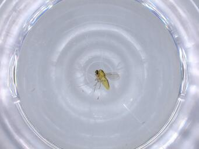 | 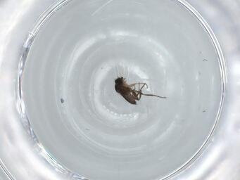 |  | 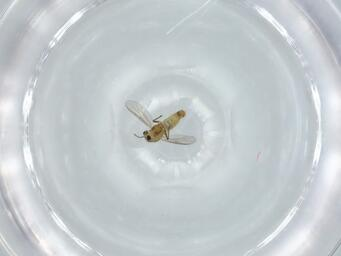 |
|:------------------------------------------------------------------------------------------------:|:------------------------------------------------------------------------------------------------:|:------------------------------------------------------------------------------------------------:|:------------------------------------------------------------------------------------------------:|
|                                           **Original**                                           |                                           **Original**                                           |                                           **Original**                                           |                                           **Original**                                           |

| 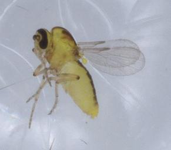 | 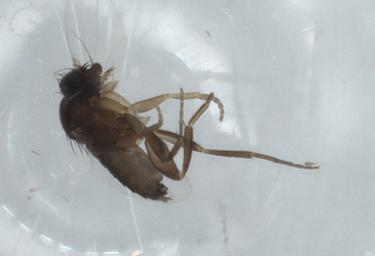 | 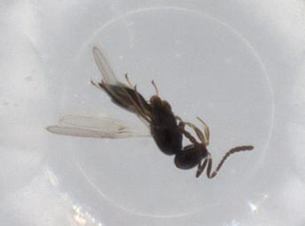 | 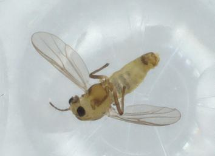 |
|:----------------------------------------------------------------------------------------------------------------:|:----------------------------------------------------------------------------------------------------------------:|:----------------------------------------------------------------------------------------------------------------:|:----------------------------------------------------------------------------------------------------------------:|
|                                               **Resized Cropped**                                                |                                               **Resized Cropped**                                                |                                                   **Resized Cropped**                                                    |                                                   **Resized Cropped**                                                    |

To resize and save original full size images, run the following:

```bash
python main.py --resize_image --resized_image_path <path_to_resized_images> --resized_hdf5_path <path_to_resized_hdf5>
``` 

To use our cropping tool, from project's [GoogleDrive](https://drive.google.com/drive/folders/1ft17GpcC_xDhx5lOBhYAEtox0sdZchjA?usp=sharing), download the available 
checkpoint **BIOSCAN_Insect_crop_tool_checkpoint.ckpt** stored in a designated 
directory **BIOSCAN_1M_Insect_checkpoints/crop_tool_checkpoint** ensuring accurate path configuration to the 
checkpoint_path in the main.py script and run the following, which creates and saves cropped images and their resized versions:

```bash
python main.py --crop_image --cropped_image_path <path_to_cropped_images> --resized_cropped_image_path <path_to_resized_cropped_images>
``` 

By setting --cropped_hdf5_path and --resized_cropped_hdf5_path, 
cropped images and resized cropped images will be saved in HDF5 file format as well.

###### <h3> Classification Experiments
Two image-based classification experiments were conducted, focusing on the taxonomy ranking of insects. 
The first set of experiments involved classifying BIOSCAN-1M Insect dataset's images into 16 Orders. 
The second set of experiments specifically targeted the Order Diptera and 
aimed to classify its members into 40 families, which constitute a significant portion of the order.

###### <h4> Train
To train the model on a classification task using a baseline model, 
you can run the following command, setting the name of the experiment:
```bash
python main.py --loader --train --data_format <hdf5/folder> --exp_name <experiment_name>
``` 
Both the folder and HDF5 data formats are supported, 
making it convenient to conduct experiments using dataset packages.

###### <h4> Test
To evaluate our top-performing models, which were trained through the experiments outlined and executed 
in the [BIOSCAN-1M-Insect paper](http://arxiv.org/abs/2307.10455), please proceed to download the available checkpoints from the 
[GoogleDrive](https://drive.google.com/drive/folders/1ft17GpcC_xDhx5lOBhYAEtox0sdZchjA?usp=sharing),  
stored in a designated directory **BIOSCAN_1M_Insect_checkpoints/classification_checkpoints**, 
ensuring accurate path configuration to the dataset images, metadata file and results within the main.py script.

Subsequently, for Order-level classification utilizing the resized and cropped images of the BIOSCAN-1M Insect Large dataset, 
execute the following instructions:

```bash
python main.py --loader --test --exp_name large_insect_order --best_model large_insect_order_vit_base_patch16_224_CE_s2 --model vit_base_patch16_224 --loss CE --seed 2 
``` 

###### <h4> Generalization
To assess the generalization capabilities of our models, which were trained on the BIOSCAN-1M-Insect dataset, 
specifically for Order-level classification involving resized and cropped images from the BIOSCAN-1M Insect Large dataset, 
it is imperative to ensure precise path configurations to the new images as well as trained model within 
the generalization.py script. Subsequently, follow these steps:

```bash
python generalization.py 
``` 


###### <h3> Requirement 
The requirements file used to run experiments is available in the requirement.txt.
  

###### <h3> Copyright and License 
The images included in the BIOSCAN-1M Insect dataset available through this repository are subject to copyright 
and licensing restrictions shown in the following:

 - Copyright Holder: CBG Photography Group
 - Copyright Institution: Centre for Biodiversity Genomics (email:CBGImaging@gmail.com)
 - Photographer: CBG Robotic Imager
 - Copyright License: Creative Commons-Attribution Non-Commercial Share-Alike
 - Copyright Contact: collectionsBIO@gmail.com
 - Copyright Year: 2021

###### <h3> Collaborators
"Ming Gong" <ming_gong@sfu.ca>  

 

 

 

